# README.md

## Scenario Description

To ensure citizen safety, the City of Ottawa has implemented a real-time data-gathering platform across three popular ice skating locations—Dow's Lake, Fifth Avenue, and the National Arts Centre (NAC). The platform collects critical metrics such as Ice Thickness, Surface Temperature, Snow Accumulation, and External Temperature. This data enables the city to make informed decisions regarding the opening or closing of skating rinks.

- Sensors are installed across the three locations to collect data continuously.
- Incoming data is processed in real time to support decision-making regarding rink availability.
- The collected data is stored in Azure Storage for future analysis and to aid in long-term planning and safety assessments.

## System Architecture

- **IoT Sensors:** Collect real-time data from the Rideau Canal, Dow's Lake, Fifth Avenue, and NAC.
- **Azure IoT Hub:** All sensor data is collected and centralized in the IoT Hub.
- **Azure Stream Analytics:** The data is analyzed and processed as required, such as calculating average ice thickness or snow accumulation on the surface.
- **Azure Blob Storage:** The processed data is stored in CSV/JSON formats for future analysis.

## Implementation Details

### IoT Sensor Simulation

- **Description:** Simulated IoT sensors generate and send data to Azure IoT Hub every 10 seconds, including location, ice thickness, surface temperature, snow accumulation, external temperature, and timestamp.
- **JSON Payload Structure:**

```json
{
    "location": "Dow's Lake",
    "iceThickness": 25.5,
    "surfaceTemperature": -3.2,
    "snowAccumulation": 12.3,
    "externalTemperature": -7.5,
    "timestamp": "2024-12-02T15:30:00Z"
}
```

### 3.2 Azure IoT Hub Configuration

#### Steps to Set Up IoT Hub:
1. **Create an IoT Hub**:
   - Navigate to the Azure portal.
   - Create a new IoT Hub and select the **Standard** tier to enable advanced features like message routing.
2. **Add a Device**:
   - In the IoT Hub, go to the **Devices** section.
   - Add a new device by specifying a unique **Device ID**.
   - Copy the **Connection String** for the newly created device; it will be used in the simulation script for authentication and data transmission.

---

### 3.3 Azure Stream Analytics Job

#### Steps to Configure the Job:
1. **Create a Stream Analytics Job**:
   - In the Azure portal, search for **Stream Analytics Jobs** and click **Create**.
   - Provide a name, select a resource group, and choose **Cloud** as the hosting environment.
   - Click **Create** to initialize the job.

2. **Set Up Input**:
   - Navigate to the **Inputs** section and click **Add**.
   - Select **IoT Hub** as the input source.
   - Configure the input with:
     - Existing IoT Hub namespace.
     - Authorization policy: Use `iothubowner`.
     - Consumer group: Choose `$Default` or create a new one.
     - Data format: Set as **JSON**.

3. **Set Up Output**:
   - Go to the **Outputs** section and click **Add**.
   - Choose **Blob Storage** as the output destination.
   - Configure the output with:
     - Select an Azure Storage Account.
     - Specify or create a container for storing processed data.
     - (Optional) Add a folder structure for file organization.
     - Select the output format: **JSON** or **CSV**.

4. **Write the Query**:
   - Create a SQL-like query to process data from the input.
   - Example Query:
     ```sql
     SELECT
         IoTHub.ConnectionDeviceId AS DeviceId,
         AVG(iceThickness) AS AvgIceThickness,
         MAX(snowAccumulation) AS MaxSnowAccumulation,
         System.Timestamp AS EventTime
     INTO
         [output]
     FROM
         [input]
     GROUP BY
         IoTHub.ConnectionDeviceId, TumblingWindow(minute, 5)
     ```


# Sample Output

The processed data from Azure Stream Analytics is stored in JSON format. Examples of the aggregated output include:

```json
{
    "DeviceId": "NAC",
    "avgIceThickness": 28.759,
    "maxSnowAccumulation": 19.2,
    "EventTime": "2024-12-02T20:50:00.0000000Z"
},
{
    "DeviceId": "FifthAvenue",
    "avgIceThickness": 26.601,
    "maxSnowAccumulation": 19.7,
    "EventTime": "2024-12-02T20:50:00.0000000Z"
},
{
    "DeviceId": "DowsLake",
    "avgIceThickness": 26.302,
    "maxSnowAccumulation": 19.9,
    "EventTime": "2024-12-02T20:50:00.0000000Z"
}
```

## Step 5: Save and Start the Job

1. Save the Stream Analytics configuration and the SQL query.
2. Click **Start** to activate the job and begin processing data in real time.

## Step 6: Verify the Job and Output

1. Navigate to the **Monitoring** tab in the Azure Portal.
2. Confirm that the job is running and processing incoming data correctly.
3. Access the configured Blob Storage container to check the processed data.

### Azure Blob Storage:

- **Data Storage Overview**
- **Storage Location**: Processed data is stored in `iotoutput`, the central storage for all Stream Analytics job outputs.
- **File Naming Convention**:
    - Example: `0_14fc4657c9f445b9a58015d0c1d57689_1.json`.
- **File Format**: Data is saved in **JSON**, a structured and machine-readable format.
- **Benefits**: JSON allows easy parsing, querying, and integration with analytics tools and services.

#### Data Content:

Each JSON file contains aggregated data, including:

- **DeviceId**: Identifies the sensor (e.g., dowslake, fifthavenue, nac).
- **AvgIceThickness**: Average ice thickness during the aggregation window.
- **MaxSnowAccumulation**: Maximum snow accumulation for the same window.
- **EventTime**: Timestamp marking the end of the aggregation period.

4. The script will simulate and display telemetry data for locations like Dow's Lake, Fifth Avenue, and NAC.

To stop the simulation, press `Ctrl + C`. The script will handle the disconnection gracefully.


# Usage Instructions

## Running the IoT Sensor Simulation:
- Install python from the official website

## Write Script:

Create a new file and save it with the `.py` extension.

```python
from datetime import datetime
import time
import random
from azure.iot.device import IoTHubDeviceClient, Message

CONNECTION_STRING = ""  # connection string for each sensor

def get_telemetry():
    return {
        "location": "Fifth Avenue",
        "iceThickness": round(random.uniform(5, 50), 2),
        "surfaceTemperature": round(random.uniform(-10, 5), 1),
        "snowAccumulation": round(random.uniform(0, 20), 1),
        "externalTemperature": round(random.uniform(-20, 10), 1),
        "timestamp": time.strftime("%Y-%m-%dT%H:%M:%SZ")
    }

def main():
    client = IoTHubDeviceClient.create_from_connection_string(CONNECTION_STRING)
    print("Sending telemetry to IoT Hub...")
    try:
        while True:
            telemetry = get_telemetry()
            message = Message(str(telemetry))
            client.send_message(message)
            print(f"Sent message: {message}")
            time.sleep(10)
    except KeyboardInterrupt:
        print("Stopped sending messages.")
    finally:
        client.disconnect()

if __name__ == "__main__":
    main()
```

This Python script simulates an IoT device sending telemetry data to an Azure IoT Hub:

1. It defines a `CONNECTION_STRING` to authenticate and connect the device (FifthAvenue) to the IoT Hub.
2. The `get_telemetry()` function generates random sensor data, including ice thickness, temperatures, and snow accumulation, along with a live timestamp.
3. In the `main()` function, the device connects to the IoT Hub and continuously sends telemetry data every 10 seconds using the `IoTHubDeviceClient`.
4. Each message is printed to the console for tracking, and the script stops gracefully when interrupted (e.g., with Ctrl+C).
5. The `if __name__ == "__main__":` block ensures the script runs when executed directly.

## Install Required Library:
Open the terminal and install the necessary library to simulate sensor data by running:

```bash
pip install azure-iot-device
```

## Update Connection String:
Replace the `CONNECTION_STRING` in the script with the connection string for your IoT device.

## Run the Script:
Execute the script in the terminal to start sending data to the IoT Hub.

## View Output:
The script will simulate and display telemetry data for locations like Dow's Lake, Fifth Avenue, and NAC.  
Each message will include details like:
- Ice thickness
- Surface temperature
- Snow accumulation
- External temperature

## Stop the Simulation:
Press `Ctrl + C` to stop the simulation. The script will handle this and disconnect gracefully.

---

# Configuring Azure Services:

## Resource Group
1. Create Resource group

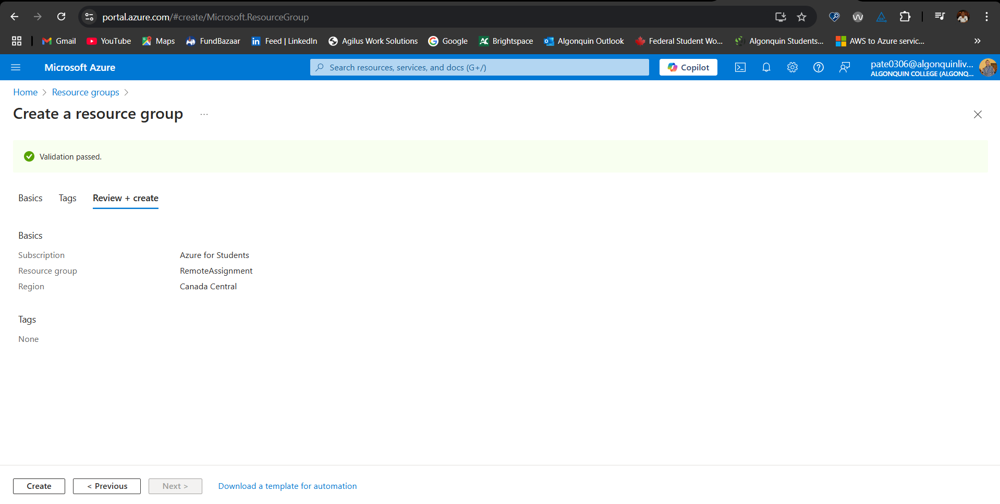

## Create an IoT Hub
1. In the Azure Portal, search for **IoT Hub** and click **Create**.
2. Provide a name for the IoT Hub and select a resource group.
3. Choose the **Free Tier** (if available) for testing purposes and create the IoT Hub.

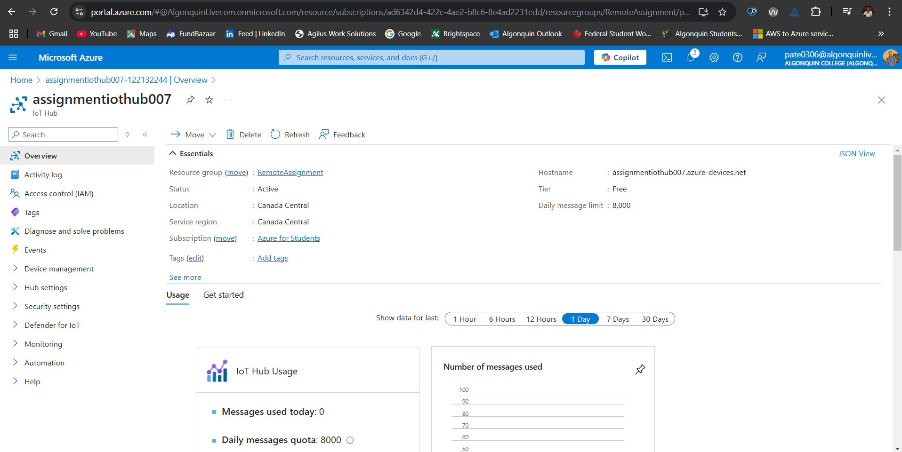

## Stroage account

1. Create Stroage account and create container


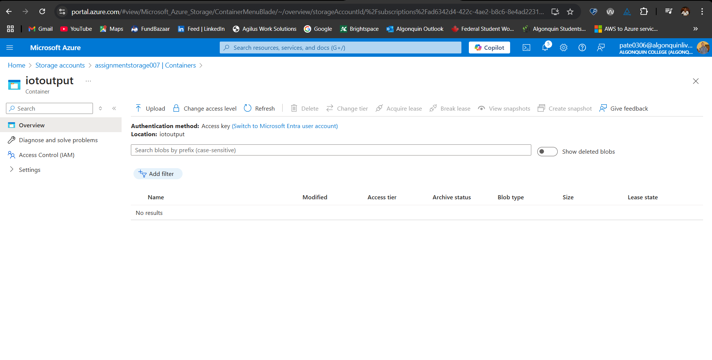

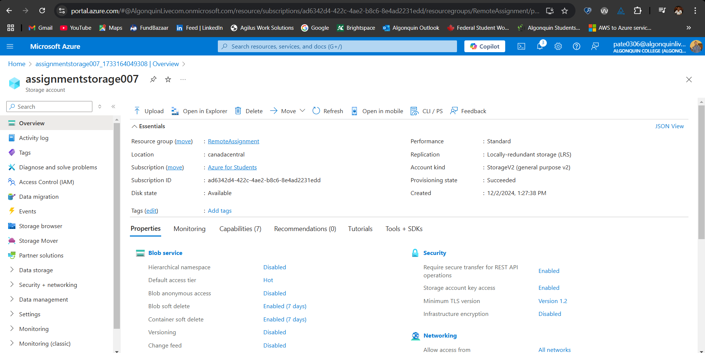


## Stream Analytics Job
1. In the Azure Portal, search for **Stream Analytics jobs** and click **Create**.
2. Provide a name for the job and select the appropriate resource group.
3. Choose **Cloud** as the hosting environment and create the job.

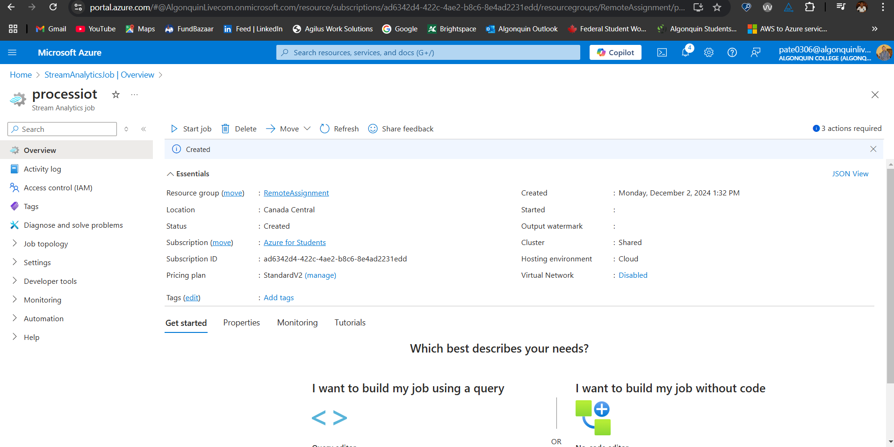


## Configure Input for Stream Analytics Job
1. In the Stream Analytics job, go to the **Inputs** section and click **Add**.
2. Choose **IoT Hub** as the input source.
3. Provide the following details:
   - **IoT Hub Namespace**: Select our IoT Hub.
   - **IoT Hub Policy Name**: Use the **iothubowner** policy.
   - **Consumer Group**: Use **$Default** or create a new consumer group in our IoT Hub.
   - **Serialization Format**: Choose **JSON**.

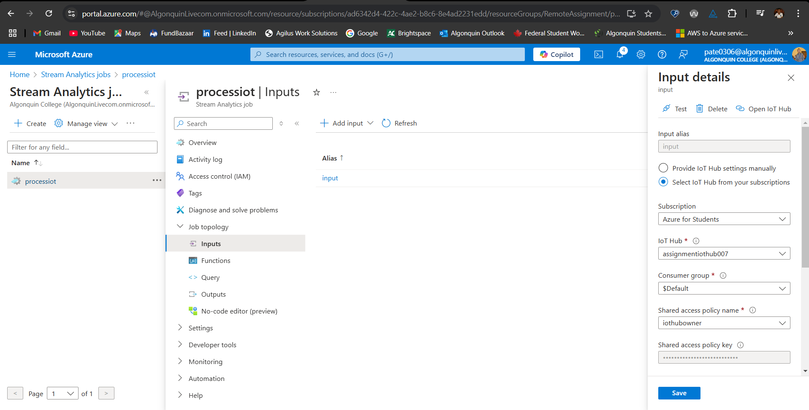

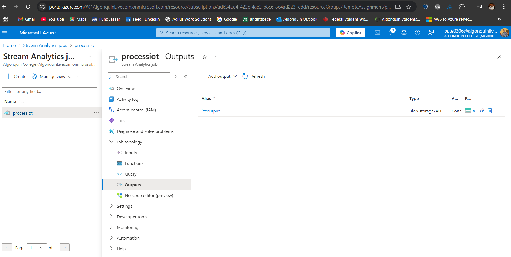

## Write the Stream Analytics Query
1. Go to the Query tab and replace the default query with the following:

 ```sql
     SELECT
         IoTHub.ConnectionDeviceId AS DeviceId,
         AVG(iceThickness) AS AvgIceThickness,
         MAX(snowAccumulation) AS MaxSnowAccumulation,
         System.Timestamp AS EventTime
     INTO
         [output]
     FROM
         [input]
     GROUP BY
         IoTHub.ConnectionDeviceId, TumblingWindow(minute, 5)
 ```

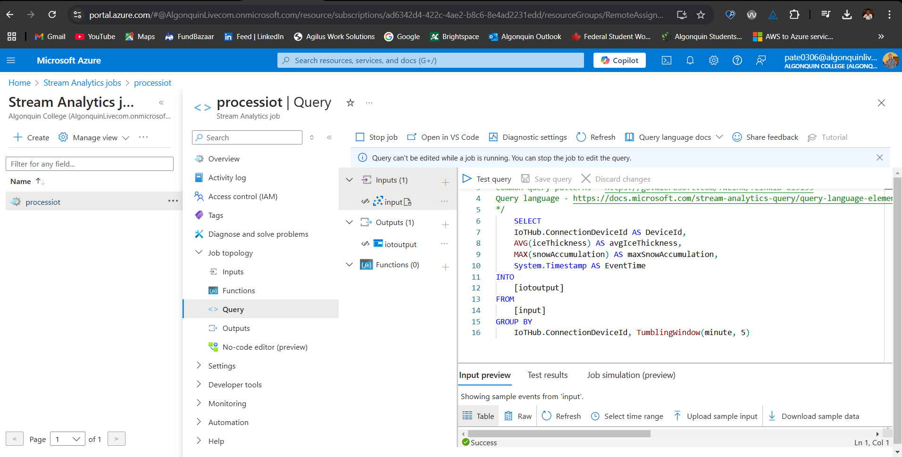

**Explanation:** This query processes real-time data in Azure Stream Analytics. It calculates the average temperature and humidity from incoming data, grouped by the devices location, over 60-second intervals using a tumbling window. The results include the device ID, the average values, and the event timestamp. The processed data is then saved to a specified output location.


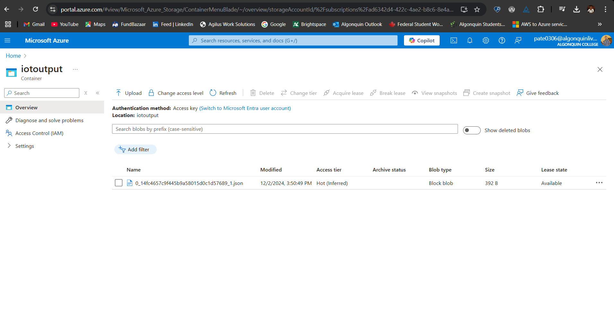

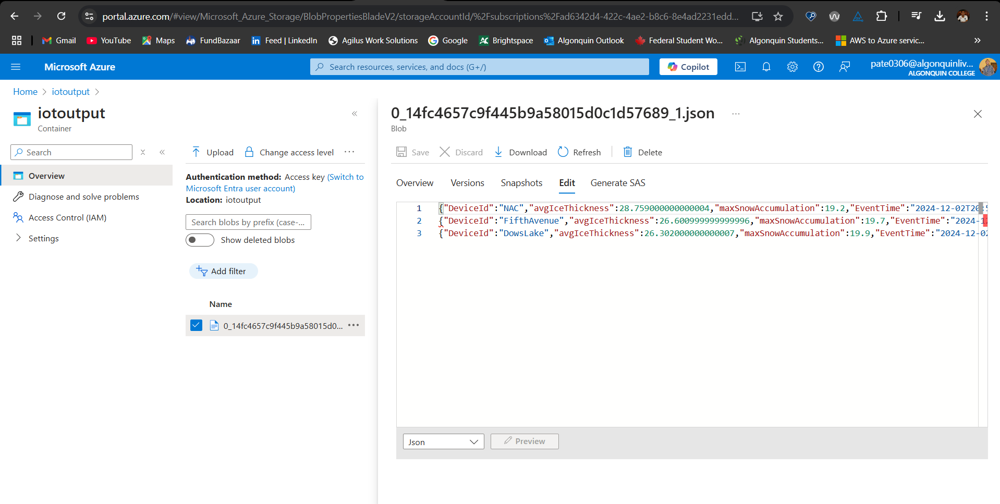

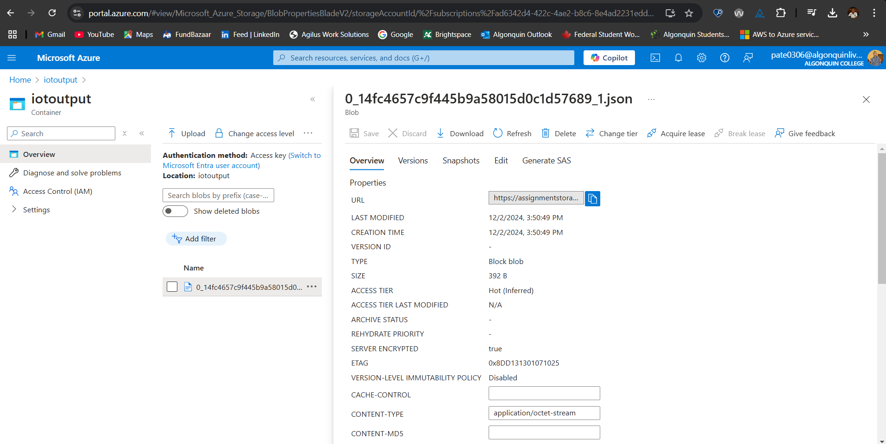

# Accessing Stored Data:
- Include steps to locate and view the processed data in Azure Blob Storage.

# Results

## Key Findings

The Stream Analytics job successfully processed real-time data from IoT sensors and stored the aggregated results in Azure Blob Storage. The key metrics derived from this data include:

- **Average Ice Thickness**: Offers insights into ice conditions over specific time intervals.
- **Maximum Snow Accumulation**: Shows the highest snow accumulation during those intervals.

## Sample Aggregated Outputs

The processed data is saved in the `output.json` file.

## Accessing the Data

You can access the stored files by navigating to the `iotoutput` container in our Azure Blob Storage account.

# Reflection:
- Discuss any challenges faced during implementation and how they were addressed.

### Experience

The setup of the Stream Analytics job went smoothly without any problems. Each step, including configuring inputs, outputs, writing the query, and processing the data, was completed successfully.

### Learning

This project gave me useful experience in real-time data processing using Azure Stream Analytics. I learned how to integrate Azure services like IoT Hub and Blob Storage to build a complete data processing pipeline.
